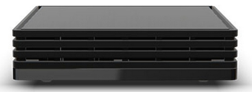

# Bbox IoT library

Bbox IoT is an Android service aiming at controlling and monitoring connected devices through high-level APIs

At this moment, this library is concentrating on Bluetooth Low Energy devices.  Further Radio protocol could be added later.

Specific features are :

* BLE devices control
* BLE connection workflow management
* high level APIs for controlling BLE workflow and devices
* flexible architecture and datamodel for multi-protocol implementation

# Version History

Current release : <a href="#">version 0.7</a>

| version                                                                |    comment                 |
|------------------------------------------------------------------------|----------------------------|
| 0.7                                                                    | API refactoring            |
| 0.6                                                                    | witti devices support      |

## Requirements

To be able to use this library, you must have a Miami Box Android TV with BboxIoT service running

# Scope

* BLE discovery
  * scanning
* BLE device control
  * association
  * connection
  * write/read characteristics
  * event monitoring
* Device database
  * store associated devices 

## Global architecture

The project you are watching is only the interface between your client and BboxIoT Service (in the middle)

## Supported devices

List of currently supported devices : 

|   Product Name               |    Manufacturer   |  functionnalities    |
|---------------------------|---------------|-----------------------------|
|   SmartLite   |     Beewi           |     state / color / intensity     |
|   SmartClim   |     Beewi          |     temperature / humidity         |
|   SmartTrack   |     Beewi          |     button single/double push (advertizing)         |
|   Aroma Light   |     AwoX          |     state / color / intensity / odor         |
|   SmartPlug   |     AwoX          |     state / active power         |
|   Flower Power   |     Parrot          |     air temperature / soil temperature / soil electroductivity / water content / luminosity         |
|   NIU   |     Altyor          |     button single push (advertizing)         |

This list is not exhaustive, please go to https://dev.bouyguestelecom.fr/forum/viewforum.php?f=36 to get a fully updated list of supported device

# Support

* BboxLab developper portal IoT section: https://dev.bouyguestelecom.fr/forum/viewforum.php?f=45
* BboxLab developper portal Download section : https://dev.bouyguestelecom.fr/forum/viewtopic.php?f=36&t=71

# License

The MIT License (MIT) Copyright (c) 2015 InnovationLab BboxLab